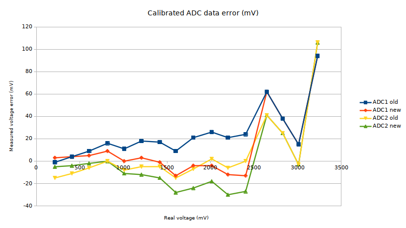

# ESP32 ADC calibration tool

This code is written to assist you in calibrating the ESP32 Analog to Digital converter. 
While newer chips are factory calibrated, older chips rely on a default VRef value and most of the time have poor ADC performance. 

This tool is based on this forum post : https://esp32.com/viewtopic.php?t=8774#p36882 .

# Disclaimer
**Performing an ADC calibration involves burning fuses, which is an irreversible operation. 
Use this code at your own risk.**

# Setup
Open this project with PlatformIO and upload to a ESP32 board.

# Usage
Open a serial console at 115200 bps on UART0. Then follow the instructions. 

The workflow is the following : 

1. Apply 150mV to GPIO25 (ADC2) and GPIO34 (ADC1). It is advised to add a decoupling capacitor next to the pins.

2. Apply 850mV to GPIO25 and GPIO34 when requested. 

3. Burn the calibration data into eFuse using `espefuse.py` tool and the values printed on the serial console. 

# Results

For ADC1 the accuracy improved in the 0.2-2.5V range. Outside this range it seems that two point calibration is not used.